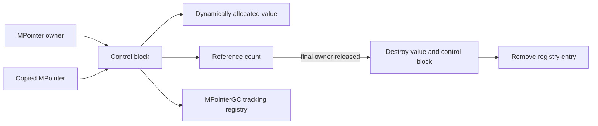
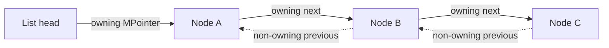

# MPointers

An educational C++ memory-management project that implements a reference-counted pointer wrapper, allocation tracking, and a custom doubly linked list.

MPointers explores how ownership, lifetime, references, and data structures interact below the abstractions provided by standard smart pointers. The project keeps those mechanisms visible so their behavior can be inspected and tested directly.

## Project Overview

The core `MPointer<T>` template owns a dynamically allocated value through a control block. Copies share that control block and increment its reference count; reset, reassignment, and destruction decrement the count and release the allocation when the final owner disappears.

A lightweight `MPointerGC<T>` registry tracks active allocations, addresses, and reference counts for diagnostics. A custom doubly linked list uses `MPointer` for its owning forward links and raw observer pointers for backward navigation.

## Core Concepts

- Templates and generic programming
- Dynamic allocation and deterministic destruction
- Shared ownership through reference counting
- Copy and move semantics
- Operator overloading
- Owning and non-owning pointers
- Allocation tracking
- Doubly linked data structures
- Bubble Sort, Insertion Sort, and Quick Sort

## Architecture / How It Works



## Pointer / Reference Model

`MPointer<T>` distinguishes ownership from observation:

- An `MPointer` instance is an owner and contributes to the reference count.
- Copy construction and copy assignment share ownership.
- Move operations transfer ownership without increasing the count.
- `reset()` and `nullptr` assignment release one owner.
- Dereferencing an empty pointer raises a clear `std::logic_error`.
- The final owner deletes both the managed value and its control block.

The linked list applies the same distinction to prevent ownership cycles:



Forward links own the node chain. Backward links and the tail are raw observer pointers whose lifetime is bounded by the owning list. This preserves bidirectional traversal without creating a cycle that would keep reference counts above zero.

## Data Structures

### `MPointer<T>`

- Reference-counted control block
- Variadic `New(...)` factory
- Copy and move semantics
- `*`, `->`, comparison, boolean, and value-assignment operators
- Allocation ID and current reference-count inspection

### `MPointerGC<T>`

- Function-local singleton instance
- Registration and removal of active allocations
- Reference-count updates and diagnostic snapshots
- Does not own or delete application values; lifetime remains controlled by `MPointer`

### `DoublyLinkedList<T>`

- Custom node chain backed by `MPointer`
- Non-owning backward links
- Append, clear, size, and value traversal operations
- Bubble Sort, Insertion Sort, and Quick Sort

## Tech Stack

- C++20
- CMake 3.20+
- CTest
- Template-based header implementation
- Optional AddressSanitizer and UndefinedBehaviorSanitizer flags on supported GCC/Clang toolchains

## Build

Requirements:

- A C++20 compiler
- CMake 3.20 or newer

```bash
cmake -S . -B build
cmake --build build
```

For a release build with a single-configuration generator:

```bash
cmake -S . -B build -DCMAKE_BUILD_TYPE=Release
cmake --build build
```

## Running

Linux and macOS:

```bash
./build/mpointers_demo
```

Windows:

```powershell
.\build\mpointers_demo.exe
```

The demonstration creates shared `MPointer` instances, prints allocation and reference information, and sorts a custom linked list.

## Testing

```bash
ctest --test-dir build --output-on-failure
```

The focused test executable validates:

- allocation registration and final release;
- copy, reset, `nullptr`, value assignment, and empty dereference behavior;
- linked-list append and clear operations;
- release of every tracked list node;
- Bubble Sort, Insertion Sort, and Quick Sort;
- empty-list sorting edge cases.

Sanitizers can be enabled when the compiler installation includes their runtimes:

```bash
cmake -S . -B build-sanitized -DMPOINTER_ENABLE_SANITIZERS=ON
cmake --build build-sanitized
ctest --test-dir build-sanitized --output-on-failure
```

## Project Structure

```text
.
├── include/
│   ├── MPointer.h
│   ├── MPointerGC.h
│   └── DoublyLinkedList.h
├── src/
│   └── main.cpp
├── tests/
│   └── MPointerTests.cpp
├── CMakeLists.txt
└── README.md
```

## Contributors

MPointers was developed collaboratively by **Ian Gómez** and project teammates.

## Academic Context

The project originated in the Algorithms and Data Structures II course at Tecnológico de Costa Rica. It was later refined for reproducible builds, explicit ownership semantics, memory-safety validation, and professional technical documentation while preserving its academic focus on implementing pointer and data-structure behavior directly.
